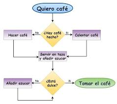

### Módulo 2: Estructura Secuencial

# Módulo 2: Estructura Secuencial



## Requisitos Previos
- Conocimiento básico de algoritmos y programación.
- Haber completado el módulo 1: Generalidades de Algoritmos.

## Descripción
En este módulo, aprenderás sobre la estructura secuencial en programación, la cual es la base para cualquier algoritmo. Esta estructura permite ejecutar instrucciones de manera ordenada, una después de otra, sin tomar decisiones o repetir bloques de código.

## Objetivos de Aprendizaje
- Comprender la importancia de la estructura secuencial en algoritmos.
- Escribir algoritmos que sigan un flujo lógico y ordenado.
- Resolver problemas utilizando la estructura secuencial para manipular datos.

## Contenido del Módulo

1. Concepto de Estructura Secuencial
2. Operaciones Básicas
3. Alternativas simples (Si NO)
4. Alternativas múltiples (Caso)
5. Estructuras anidadas
6. Ejemplos de Aplicación

## Desarollo del contenido
En este tema, se introduce la estructura secuencial, la base de cualquier algoritmo. Se explica cómo las instrucciones en un algoritmo secuencial se ejecutan en el orden en que se escriben, una después de la otra, sin saltos ni repeticiones. Este flujo lineal es crucial para entender cómo funcionan los programas más básicos y es el punto de partida para cualquier programador. El objetivo es que los estudiantes comprendan que la estructura secuencial es el esqueleto de cualquier programa y cómo se pueden combinar operaciones básicas para realizar tareas más complejas.

### **Operaciones**
Este tema se enfoca en las operaciones fundamentales que se pueden realizar dentro de una estructura secuencial, incluyendo:

- Entrada y salida de datos: Cómo pedir y mostrar información al usuario.
- Operaciones aritméticas: Suma, resta, multiplicación, y división, y cómo se utilizan en el desarrollo de algoritmos.
- Asignación de valores: Cómo almacenar resultados en variables para su uso posterior en el algoritmo.

Los estudiantes aprenderán a realizar cálculos simples y a manipular datos utilizando estas operaciones dentro de una estructura secuencial.

Se proporcionan ejemplos prácticos que demuestran cómo aplicar la estructura secuencial para resolver problemas reales. Se incluyen ejercicios como calcular el área de un rectángulo, convertir temperaturas de Celsius a Fahrenheit, y calcular el promedio de un conjunto de números. Estos ejemplos ayudan a solidificar el entendimiento de la estructura secuencial y permiten a los estudiantes practicar la creación de algoritmos que siguen un flujo lógico de principio a fin.

## Ejemplos en lenguaje pseudocódigo (PSeInt)

- **Ejemplo 1: Calcular Promedio**

  - Descripción Ejemplo 1: Calcular el promedio de tres números. Un algoritmo que solicita tres números al usuario y calcula su promedio.
  - Código de ejemplo:
  ```pseudocode
        Escribir "Ingrese el primer número:"
        Leer num1
        Escribir "Ingrese el segundo número:"
        Leer num2
        Escribir "Ingrese el tercer número:"
        Leer num3
        promedio = (num1 + num2 + num3) / 3
        Escribir "El promedio es: ", promedio
  ```

- **Ejemplo 2: Conversor grados Celsius a Fahrenheit**
- Descripción Ejemplo 2: Diseña un algoritmo que convierta una temperatura dada en grados Celsius a Fahrenheit.
- Código de ejemplo:
  ```pseudocode
        Escribir "Ingrese la temperatura en grados Celsius:"
        Leer celsius
        fahrenheit = (celsius * 9/5) + 32
        Escribir "La temperatura en grados Fahrenheit es: ", fahrenheit
  ```

- **Ejemplo 3: Área del rectángulo**
- Descripción Ejemplo 3: Un algoritmo que calcula el área de un rectángulo a partir de su base y altura.
  - Código de ejemplo:
  ```pseudocode
        Escribir "Ingrese la base del rectángulo:"
        Leer base
        Escribir "Ingrese la altura del rectángulo:"
        Leer altura
        area = base * altura
        Escribir "El área del rectángulo es: ", area
  ```
### **Alternativas secuenciales usando condicionales**

[Ver alternativas simples](Si/README.md)

[Ver alternativas múltiples](Segun/README.md)

[Ver estructuras anidadas](Anidadas/README.md)

## Contribuciones
Si deseas contribuir con ejemplos o ejercicios para este módulo, por favor sigue las instrucciones de contribución.

## Recursos Adicionales
- Documentación de PSeInt
- Ejercicios de práctica

## Autor

- Nombre: Julian A. Peña
- Email: japenar@escolme.edu.co

## Licencia
Este contenido está bajo la licencia Creative Commons, consulta los detalles en LICENSE.

## Agradecimientos
- Agradecimiento a los desarrolladores de PSeInt.
- Agradecimiento a los colaboradores del curso.