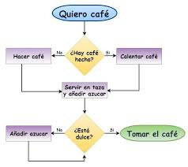

### Módulo 5: Arreglos y Vectores

# Tema: Manejo de Arreglos y Vectores en Programación



## Requisitos Previos
- Conocimiento básico de algoritmos y programación.
- Haber completado el módulo 4: Estructura repetitiva.

## Descripción
Este módulo se centra en la manipulación de arreglos y vectores, estructuras de datos fundamentales en la programación. Se explorarán operaciones comunes como la búsqueda, el ordenamiento, la lectura y la escritura de datos dentro de estos arreglos, utilizando algoritmos ampliamente reconocidos.


## Objetivos de Aprendizaje
- Comprender la estructura y utilidad de los arreglos y vectores en la programación.
- Implementar algoritmos básicos y avanzados para la búsqueda y ordenamiento de datos en arreglos.
- Realizar operaciones de lectura y escritura en arreglos y vectores.
- Familiarizarse con algoritmos famosos y su aplicación en contextos empresariales.

## Contenido del Módulo
1. Introducción a Arreglos y Vectores
2. Operaciones de Lectura y Escritura en Arreglos
3. Búsqueda en Arreglos
4. Ordenamiento de Arreglos
5. Algoritmos Famosos para Manipulación de Arreglos


## Desarollo del contenido
Definición de arreglos y vectores, su estructura en memoria y cómo se diferencian de otras estructuras de datos.

Ejemplo básico: 
```
arreglo <- [10, 20, 30, 40, 50]
Escribir arreglo[3] // Salida: 30
```

Cómo acceder y modificar elementos en un arreglo o vector.
Ejemplo de lectura y escritura:
```
arreglo[2] <- 25
Escribir arreglo[2] // Salida: 25
```

Explicación de técnicas de búsqueda, incluyendo búsqueda lineal y binaria.
Algoritmo de Búsqueda Lineal:
```
Para i <- 1 Hasta N Hacer
    Si arreglo[i] = valor_buscado Entonces
        Escribir "Valor encontrado en la posición ", i
        Romper
    FinSi
FinPara
```

Algoritmo de Búsqueda Binaria (para arreglos ordenados):
```
izquierda <- 1
derecha <- N
Mientras izquierda <= derecha Hacer
    mitad <- (izquierda + derecha) / 2
    Si arreglo[mitad] = valor_buscado Entonces
        Escribir "Valor encontrado en la posición ", mitad
        Romper
    SiNo
        Si arreglo[mitad] < valor_buscado Entonces
            izquierda <- mitad + 1
        SiNo
            derecha <- mitad - 1
        FinSi
    FinSi
FinMientras
```

Descripción: Discusión de diferentes algoritmos de ordenamiento, incluyendo el método de burbuja, selección y el método rápido (Quicksort).
Algoritmo de Ordenamiento Burbuja:
```
Para i <- 1 Hasta N-1 Hacer
    Para j <- 1 Hasta N-i Hacer
        Si arreglo[j] > arreglo[j+1] Entonces
            temp <- arreglo[j]
            arreglo[j] <- arreglo[j+1]
            arreglo[j+1] <- temp
        FinSi
    FinPara
FinPara
```

Algoritmo Quicksort (conceptual):
```
Función quicksort(arreglo, izquierda, derecha)
    Si izquierda < derecha Entonces
        pivote <- particion(arreglo, izquierda, derecha)
        quicksort(arreglo, izquierda, pivote-1)
        quicksort(arreglo, pivote+1, derecha)
    FinSi
FinFunción
```

**Algoritmos Famosos para Manipulación de Arreglos**

Presentación de algoritmos clásicos y su relevancia en la programación actual.
- Ordenamiento Rápido (Quicksort)
- Búsqueda Binaria
- Ordenamiento por Mezcla (Merge Sort)
- Algoritmo de Kadane para encontrar la subcadena máxima en un vector

Ejemplos de cómo estas operaciones y algoritmos se utilizan en contextos empresariales, como la organización de datos de ventas, la búsqueda de clientes en bases de datos y la optimización de procesos.


## Ejemplos en lenguaje pseudocódigo (PSeInt)

- **Ejemplo 1: Implementación de un Sistema de Inventario**

  - Descripción Ejemplo: Desarrollar un programa que permita la entrada, ordenamiento y búsqueda de productos en un sistema de inventario utilizando arreglos.
  - Código de ejemplo:
  ```pseudocode
        productos <- [ ]
        // Funciones para agregar, ordenar y buscar productos
  ```
  
## Contribuciones
Si deseas contribuir con ejemplos o ejercicios para este módulo, por favor sigue las instrucciones de contribución.

## Recursos Adicionales
- Documentación de PSeInt
- Ejercicios de práctica

## Autor

- Nombre: Julian A. Peña
- Email: japenar@escolme.edu.co

## Licencia
Este contenido está bajo la licencia Creative Commons, consulta los detalles en LICENSE.

## Agradecimientos
- Agradecimiento a los desarrolladores de PSeInt.
- Agradecimiento a los colaboradores del curso.