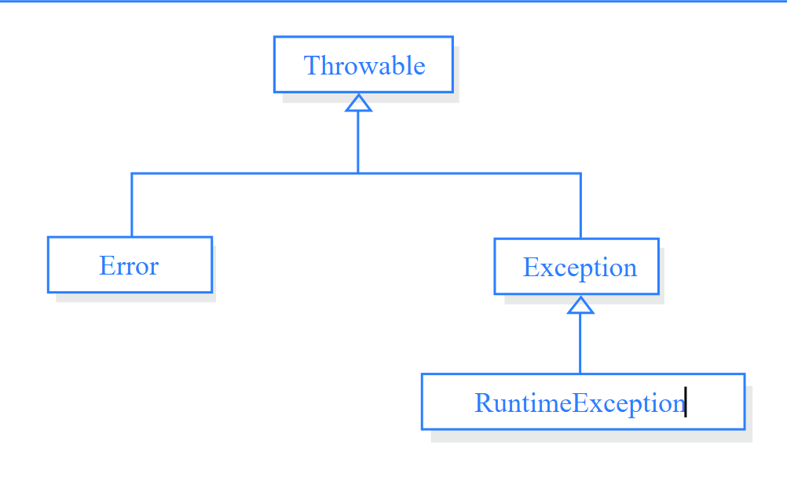

### Módulo EXTRA: Errores

# Tema: Manejo de errores

## Requisitos Previos

- Conocimiento básico de algoritmos y programación.

## Descripción

Este módulo exhibe diversos casos de errores al diseñar algoritmos, algunos de ellos pueden ser debido a la sintaxis, por ejecución o por error lógico o humano. Se presentarán ejemplos prácticos cometiendo errores con cada una de las operaciones que se pueden realizar bien sea emitir una salida de mensaje como utilizar estructuras y arreglos para operaciones complejas.

## Objetivos de Aprendizaje

- Comprender el flujo secuencial y ordenado de los algoritmos obteniendo resultados esperados.
- Identificar la sintaxis correcta al programar.

## Contenido del Módulo

1. Errores de sintaxis

2. Errores de ejecución

3. Error lógico

## Desarollo del contenido

Un **error de sintaxis** ocurre cuando un programador escribe una instrucción no válida. Simplemente escribir mal una palabra del lenguaje provocará un error de sintaxis. Son aquellos que aparecen mientras se escribe código. Si usas PSeint el programa comprueba el código mientras lo escribes en la ventana **Editor de código** y te avisa si comete un error, como una falta de ortografía de una palabra o el uso incorrecto de un elemento de lenguaje.

Un **error de ejecución**, o errores de tiempo de ejecución , ocurren mientras se ejecuta un programa. Esto implica código que puede parecer correcto en que no tiene errores de sintaxis, pero que no se ejecutarán. Por ejemplo, podría escribir correctamente una línea de código para abrir un archivo, pero si el archivo no existe, la aplicación no puede abrir el archivo y produce una excepción. Para corregir la mayoría de los errores en tiempo de ejecución, vuelve a escribir el código defectuoso o mediante el control de excepciones y vuelve a compilarlo y a ejecutarlo.

Los **errores lógicos** son aquellos que aparecen una vez que la aplicación está en uso. Suelen ser suposiciones erróneas realizadas por el desarrollador, o resultados no deseados o inesperados en respuesta a las acciones del usuario. Por ejemplo, una clave con tipo incorrecto puede proporcionar información incorrecta a un método, o puede suponer que un valor válido siempre se proporciona a un método cuando no es así. Aunque los errores lógicos se pueden controlar mediante el control de excepciones, normalmente deben solucionarse corrigiendo el error en la lógica y recompilando la aplicación. 

## Contribuciones
Si deseas contribuir con ejemplos o ejercicios para este módulo, por favor sigue las instrucciones de contribución.

## Recursos Adicionales
- Ejercicios con errores
- Documentación Microsoft Learn

## Autor

- Nombre: Julian A. Peña
- Email: japenar@escolme.edu.co

## Licencia
Este contenido está bajo la licencia Creative Commons, consulta los detalles en LICENSE.

## Agradecimientos
- Agradecimiento a los desarrolladores de PSeInt.
- Agradecimiento a los colaboradores del curso.